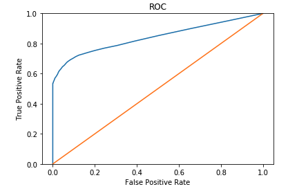

# Fruad_Prediction
A tree based model to predict the probability of a transaction being fraud.

# Problem Statement
Whenever an online order is placed by a user at E-commerce websites, there is a risk that the user might be performing some fraudulent activities.  The goal of this project is to predict the probability that the first transaction of a new user is fraudulent. 

# Description
- Fraud_Data.csv: Demographic-related information about new users, and whether their first transactions on the site are fraudulent or not.
- IpAddress.csv: The dataset can be used to get user country based on their Ip address.
- fraud_detection.ipynb: A supervised machine learning model to predict the probability
# Model Result

- Depending on the costs of false positive vs false negatives, we can choose the optimal cutoff point to minimize the overall cost. If the focus is on minimizing the number of false postives, we would choose a cut-off that would give us true positive rate near 0.6 and false positive rate basically zero. If we were to capture as many positive cases as possiable, we could decrease the value of the cutoff point, so that the model will classify more events as 1. However, in this case, only events with a very low probability of being a fraud will be classfied as 0.
- In this project, the objective function is: (1-class1_error) - class0_error. That is, we are willing to increase class0_error by a certain number as long as class1_error goes down by a larger number.
- The optimal cutoff point gives us 69% true positive rate and very low false positive rate (7%).
- To minimize the cost of misclassifications, we can have a two-step verification approach. In other words, if the predicted probability is above a threshold, we can create an additional verification step, such as phone number verifications. 
